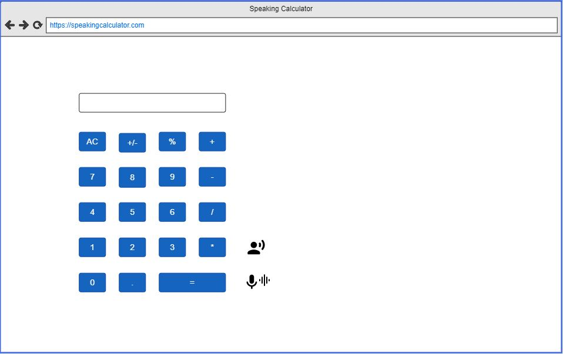
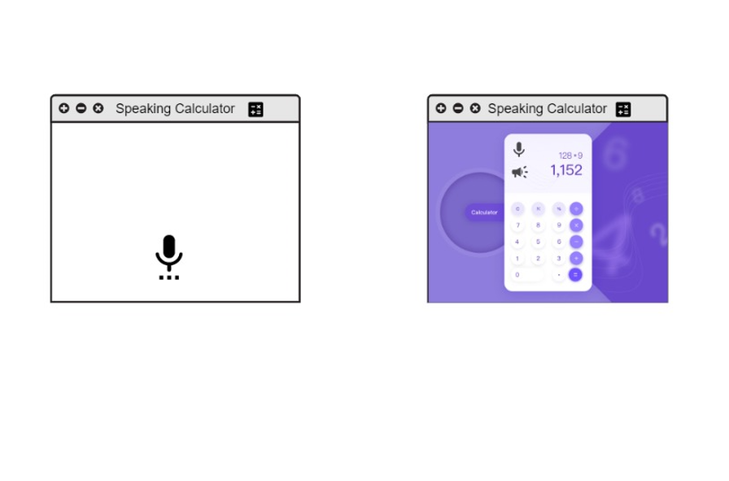
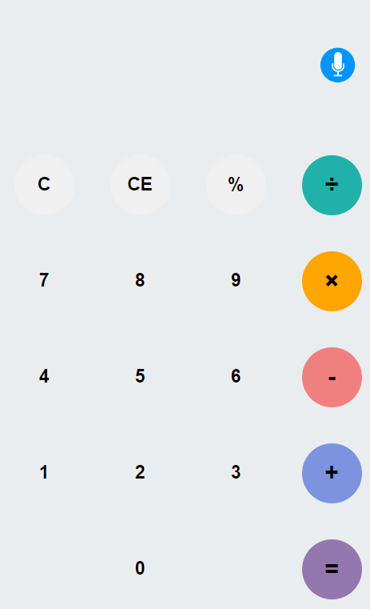
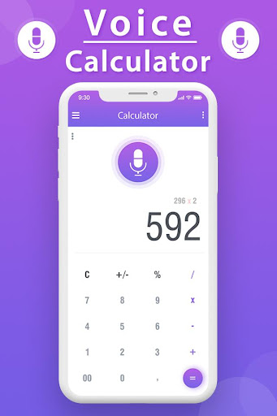
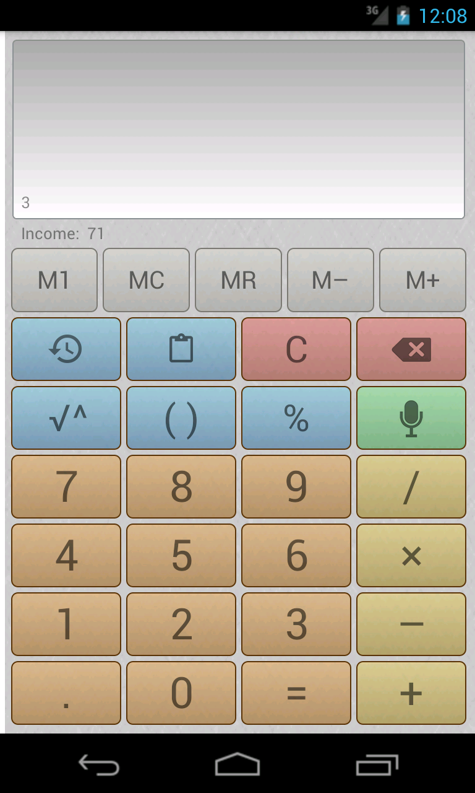

##### September 9th

###### Anjana Thanguturi 
Designed prototype and discussed about that in client meeting. Need to do the updates and also work on database schema.
 

###### Sindhuja Vilipala
I designed a prototype and discussed it with team members and with the professor, I need to do some changes as per the professor’s suggestion. 

###### Srujan Kumar Reddy Yeruva
Have designed the UI layout for the protoypes and discussed the same with professor. Work on DB schemas which is planned for next week.
 

###### Naina Sahiri
As discussed with the client, worked on the UI design prototype and discussed about the project timelines.
 

###### Madhupriya Gundeti
Designed the layout for prototype and we are planning to work on database schema next week.
 

-----------------------------------------------------------------------------------------------
##### September 12th

###### Sindhuja Vilipala

Actually, we designed a prototype first, but we have updated some changes in prototype and designed a prototype. 
 

###### Anjana Thanguturi
Tried to work on Database Schema but found some difficulties. After client team meeting we got a solution. 
We also have to implement WebSeeph API sample prototype as per client request.

###### Madhupriya Gundeti
Worked to design the updated prototype with one of my team member.

###### Srujan Kumar Reddy Yeruva
Faced some obstacles while working on DB schema. Discussed the same with client and found a solution.
Also started to work on implementing Web Speech API.

###### Naina Sahiri
Assigned with task to design UI page (HTML, CSS) for Prototype. 

-----------------------------------------------------------------------------------------------
##### September 16th

###### Anjana Thanguturi
Worked on implementation of SpeechRecognition Interface of WebSpeech API as per client request and successfully implemented.

###### Srujan Kumar Reddy Yeruva
Worked on implementing Speech synthesis which is to translate speech from text. The code is implemented in the prototype.

###### Sindhuja Vilipala
Worked on implementation of WebSpeech API of SpeechRecognition with one of my team member.

###### Madhupriya Gundeti
Designed a DB Schema called History table in the lucid chart with two attributes Time_Stamp and Expression.

###### Naina Sahiri
I have designed the front page functionality prototype using HTML, CSS and executed.

-----------------------------------------------------------------------------------------------
#### September 19th

###### Anjana Thanguturi
Need to work on execution of mathematical expression based on user input using speech recognition.

###### Sindhuja Vilipala
I have planned to work on Math Expressions on Speech Recognition. I and Anjana worked on Speech Recognition i.e, speech to text, to execute math Expressions.

###### Madhupriya Gundeti
Have to work on automate Speech Synthesis as welcome message. Worked on Database Schema.

###### Srujan Kumar Reddy Yeruva
Work on implementing speech synthesis on arithmetic results. Also implement speech synthesis without button trigger.

###### Naina Sahiri
Integrating the Web Speech API prototype with the functionality of speaking voice recognition.

-----------------------------------------------------------------------------------------------
#### September 21th

###### Madhupriya Gundeti
Planning to change oracle to sqlite as we can query directly in the browser.

###### Naina Sahiri
Combining the Web Speech API prototype's voice recognition features

-----------------------------------------------------------------------------------------------
#### September 23rd

###### Anjana Thanguturi
Implemented code for execution of arithmetic operations based on user speech using speechRecognition. I and sindhuja still need to work on trigonometric function execution.

###### Srujan Kumar Reddy Yeruva
Worked on Speech Synthesis(Text to Speech) for prototype without button trigger. Need to work around Speech Synthesis so that it works completely.

###### Naina Sahiri
Working on the SQL lite with one of the team member and need to work on Sqlite.js Javascript SQL databse

###### Sindhuja Vilipala
Worked on sin function in trigonometric equation.

###### Madhupriya Gundeti
Need to work on Sqlite.js Javascript SQL databse.

-----------------------------------------------------------------------------------------------
#### September 26th

###### Srujan Kumar Reddy Yeruva
Worked on Speech Synthesis(Text to Speech) for prototype without button trigger. Need to work around Speech Synthesis so that it works completely

###### Anjana Thanguturi
Worked on implementing of trignometric functions but have to look into all functions implementations because some functions are not recongnizing

###### Sindhuja Vilipala
Worked on the implementation of all the the trignometric functions but unable to execute all.

#### September 28th

###### Srujan Kumar Reddy Yeruva
Worked on presentation for workshop. Shared newly learned topics with our fellow classmates.

